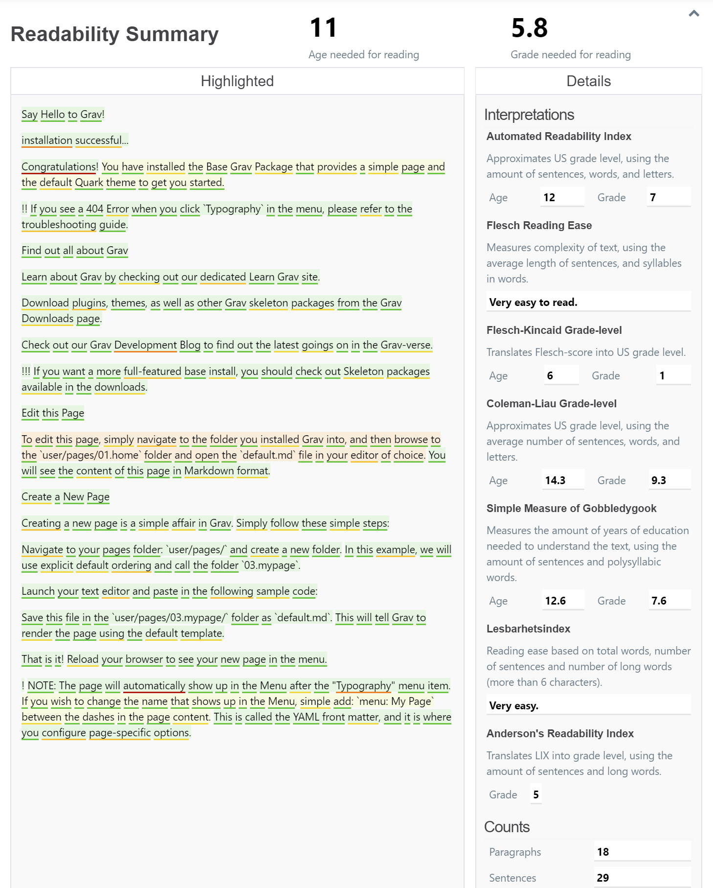

# Readability Plugin

The **Readability** Plugin is an extension for [Grav CMS](http://github.com/getgrav/grav), and lets you measure the readability of your writing within the Admin Plugin, as well as highlight the difficulty of sentences and words.

## Installation

Installing the Readability Plugin can be done in one of three ways. The GPM (Grav Package Manager) installation method enables you to quickly and easily install the Plugin with a simple terminal command, while the manual method enables you to do so via a zip file.

## Installation

Installing the Readability Plugin plugin can be done in one of three ways: The GPM (Grav Package Manager) installation method lets you quickly install the plugin with a simple terminal command, the manual method lets you do so via a zip file, and the admin method lets you do so via the Admin Plugin.

### GPM Installation (Preferred)

To install the plugin via the [GPM](http://learn.getgrav.org/advanced/grav-gpm), through your system's terminal (also called the command line), navigate to the root of your Grav-installation, and enter:

    bin/gpm install readability

This will install the Readability Plugin plugin into your `/user/plugins`-directory within Grav. Its files can be found under `/your/site/grav/user/plugins/readability`.

### Manual Installation

To install the plugin manually, download the zip-version of this repository and unzip it under `/your/site/grav/user/plugins`. Then rename the folder to `readability`. You can find these files on [GitHub](https://github.com/OleVik/grav-plugin-readability) or via [GetGrav.org](http://getgrav.org/downloads/plugins#extras).

You should now have all the plugin files under

    /your/site/grav/user/plugins/readability
	
> NOTE: This plugin is a modular component for Grav which may require other plugins to operate, please see its [blueprints.yaml-file on GitHub](https://github.com/OleVik/grav-plugin-readability/blob/master/blueprints.yaml).

### Admin Plugin

If you use the Admin Plugin, you can install the plugin directly by browsing the `Plugins`-menu and clicking on the `Add` button.

## Configuration

Before configuring this plugin, you should copy the `user/plugins/readability/readability.yaml` to `user/config/plugins/readability.yaml` and only edit that copy.

Here is the default configuration and an explanation of available options:

```yaml
enabled: true
language: "en-us"
tooltips: false
```

The `language`-string corresponds to the [patterns defined by the Fluid Project](https://github.com/fluid-project/hyphenation-patterns/tree/master/patterns), specifically the name of the file without the extension.

If `tooltips` is set to `true`, sentences and words can be focused by hover them with your mouse pointer, to point out difficulty. The sentence-difficulty is displayed above the sentence, and word-difficulty below the word.

## Usage

When editing a Page in the Admin Plugin, simply click the "Readability"-button in the toolbar at the top of the page:


And output is rendered:



Optionally focused on:


## Contributing

This plugin largely wraps the [Localized Readability](https://github.com/OleVik/localized-readability/) package for Node up for use with Grav, hence languages are not added here. See the [Contributing-section](https://github.com/OleVik/localized-readability#contributing) on that repository for information about adding languages.

## Credits

[MIT](LICENSE) by 2019 Ole Vik
